# ESP-SDR source for SDR++ (ESP32-S3)

<a href="https://youtu.be/sy-2_04tZBM" target="_blank">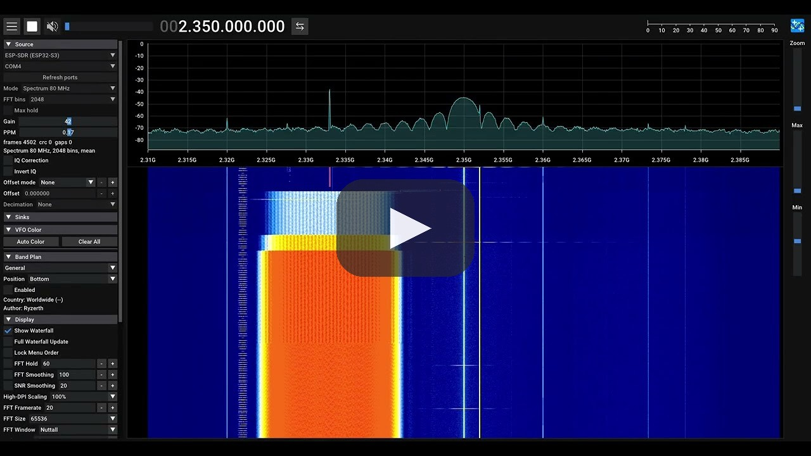</a>

*Demo video (YouTube): the ESP32-S3 streaming an 80 MHz on-chip spectrum into SDR++.*

Native [SDR++](https://github.com/AlexandreRouma/SDRPlusPlus) source module for an ESP32-S3 running [ESP-SDR](https://github.com/ESPARGOS/esp-sdr): real IQ over the plain USB cable, straight into SDR++, with no bridge, plugin stack or network server in between.

- 250 / 125 / 62.5 kS/s gapless complex IQ (two-stage FIR DDC on the S3's second core)
- 2204–2804 MHz in 1 kHz steps, gain index 0–82, ppm correction
- CRC and sample-index continuity checked on every frame, shown in the source menu

**Measured against a HackRF One on the same conducted chain** ([comparison](#compared-with-a-hackrf-one-6-oct-2026)): noise figure 10.9 dB vs 13 dB, NBFM 12 dB S/N at −115 dBm vs −113.5 dBm, phase noise at 1 kHz ≤ −86 vs −80 dBc/Hz, IQ image −56 … −65 vs −47 … −54 dBc. The HackRF keeps the higher strong-signal S/N (48 vs 42 dB) and handles strong nearby signals better.

For SDR#, Android or remote use over the network, see [esp-sdr-bridge](https://github.com/z2labs/esp-sdr-bridge) (SpyServer + rtl_tcp). On Android see [Android (USB OTG)](#android-usb-otg) below.

## Download

Ready-to-run **SDR++ ESP** packages with this module already included, from the [latest release](https://github.com/z2labs/sdrpp-esp-sdr-source/releases/latest):

| Package | Platform |
| --- | --- |
| [`sdrpp-esp_windows_x64.zip`](https://github.com/z2labs/sdrpp-esp-sdr-source/releases/download/v0.2.0/sdrpp-esp_windows_x64.zip) | Windows 10/11 x64. Unzip and run `sdrpp.exe`. |
| [`sdrpp-esp_macos_arm.zip`](https://github.com/z2labs/sdrpp-esp-sdr-source/releases/download/v0.2.0/sdrpp-esp_macos_arm.zip) | macOS, Apple Silicon (`SDR++.app`). |
| [`sdrpp-esp_debian_bookworm_amd64.deb`](https://github.com/z2labs/sdrpp-esp-sdr-source/releases/download/v0.2.0/sdrpp-esp_debian_bookworm_amd64.deb) | Debian 12 x64. |
| [`sdrpp-esp_ubuntu_noble_amd64.deb`](https://github.com/z2labs/sdrpp-esp-sdr-source/releases/download/v0.2.0/sdrpp-esp_ubuntu_noble_amd64.deb) | Ubuntu 24.04 x64. |
| [`sdrpp-esp.apk`](https://github.com/z2labs/sdrpp-esp-sdr-source/releases/download/v0.2.0/sdrpp-esp.apk) | Android, USB OTG. Installs next to the official SDR++. |

The same files are published in the [z2labs/SDRPlusPlus esp-v0.2.0 release](https://github.com/z2labs/SDRPlusPlus/releases/tag/esp-v0.2.0), where they are built by CI. This is a fork build, not an official SDR++ release. The .deb packages use the official SDR++ package name, so installing one replaces an official SDR++ installation. To load the module into your own SDR++ build instead, see [Use](#use) and [Build](#build).

## Android (USB OTG)

<a href="https://youtu.be/C4irjaCictg" target="_blank">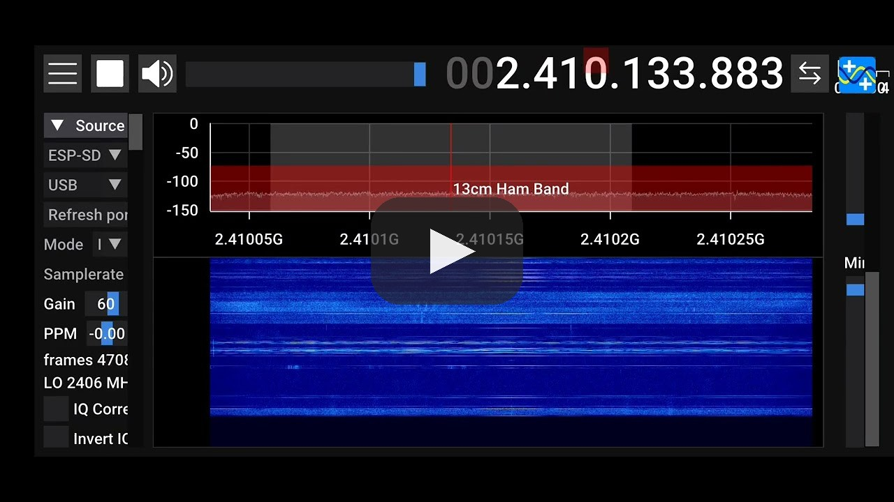</a>

*Demo video (YouTube): the ESP32-S3 on an Android phone over USB OTG, 80 MHz spectrum and IQ mode.*

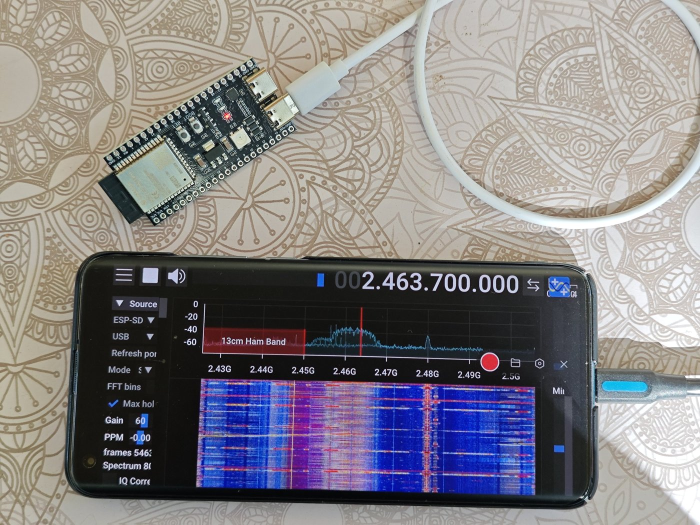

The same module runs on Android in **SDR++ ESP**, a build of the [z2labs/SDRPlusPlus](https://github.com/z2labs/SDRPlusPlus) fork (branch `esp-sdr`): IQ with demodulation and the 16 / 40 / 80 MHz spectrum mode, over a USB OTG cable, no PC. Download the APK from the [latest release](https://github.com/z2labs/sdrpp-esp-sdr-source/releases/latest) ([`sdrpp-esp.apk`](https://github.com/z2labs/sdrpp-esp-sdr-source/releases/download/v0.2.0/sdrpp-esp.apk)). It installs next to the official SDR++.

Connect the board's **native USB** port (Espressif USB Serial/JTAG, 303A:1001; on devkits usually the one marked USB, not UART), start the app, allow USB access, then choose source **ESP-SDR (ESP32-S3)** and port **USB**.

## FM broadcast band through an upconverter

<a href="https://youtu.be/WVA4J9Fg5GE" target="_blank">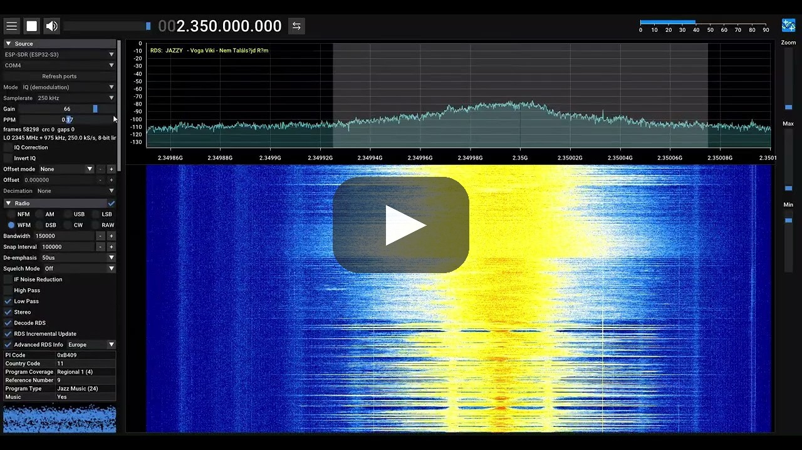</a>

*Demo video (YouTube): the ESP32-S3 Wi-Fi radio listening to the FM broadcast band through a moRFeus upconverter.*

The S3's receiver only tunes 2.2–2.8 GHz, so here it is the IF stage behind a [moRFeus](https://www.crowdsupply.com/othernet/morfeus) upconverter (Othernet, Crowd Supply), a frequency converter and signal generator whose RF and hardware design was done by Zoltan Doczi as a consultant. With the moRFeus LO at 2259.1 MHz, 90.9 MHz (Jazzy) lands at 2350 MHz. The on-chip 40 MHz spectrum mode then shows the whole FM band, from about 71 to 111 MHz, at once in SDR++, and IQ mode demodulates it (WFM, stereo). On coax with a VSG60, the same receiver measured 12 dB SINAD at about −114 dBm for narrowband FM at 2.35 GHz, with a strong-signal SINAD of around 42 dB (see [Measurements](#measurements)).

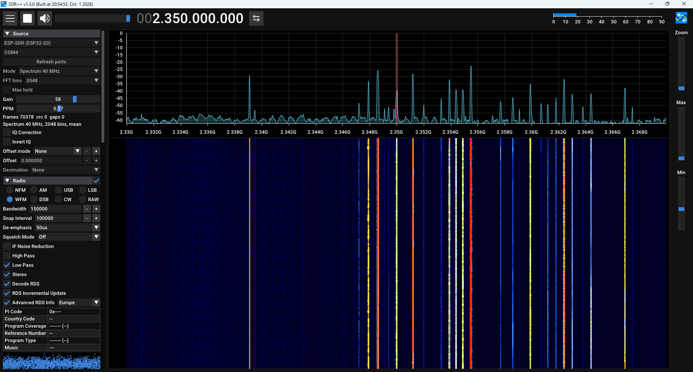

| Station | RF | ESP32-S3 IF | LO |
| --- | --- | --- | --- |
| Jazzy | 90.9 MHz | 2350 MHz | 2259.1 MHz |

To read the band directly in SDR++, set *Offset mode* to *Custom* and the offset to −LO. For listening, use IQ mode at 250 kS/s with WFM in the Radio module.

## Measurements

### Compared with a HackRF One (6 Oct 2026)

On the same conducted chain as a HackRF One (TCXO) ([details](docs/MEASUREMENTS.md#comparison-esp32-s3-vs-hackrf-one-vs-bb60c)):

| | ESP32-S3 | HackRF One |
| --- | --- | --- |
| Noise figure (2350 MHz) | 10.9 dB | 13 dB |
| NBFM 12 dB S/N (2350 / 2700 MHz) | −115 / −111.6 dBm | −113.5 / −112.8 dBm |
| Phase noise at 1 kHz | ≤ −86 dBc/Hz | −80 dBc/Hz |
| IQ image | −56 … −65 dBc | −47 … −54 dBc |
| Strong-signal S/N ceiling | 42 dB | 48 dB |
| Blocking | saturates above ≈ −55 dBm within ±5 MHz at gain 70 | filtered beyond ±3 MHz at 2 MS/s |

Same sensitivity; the S3 is cleaner close in, the HackRF handles strong nearby signals better.

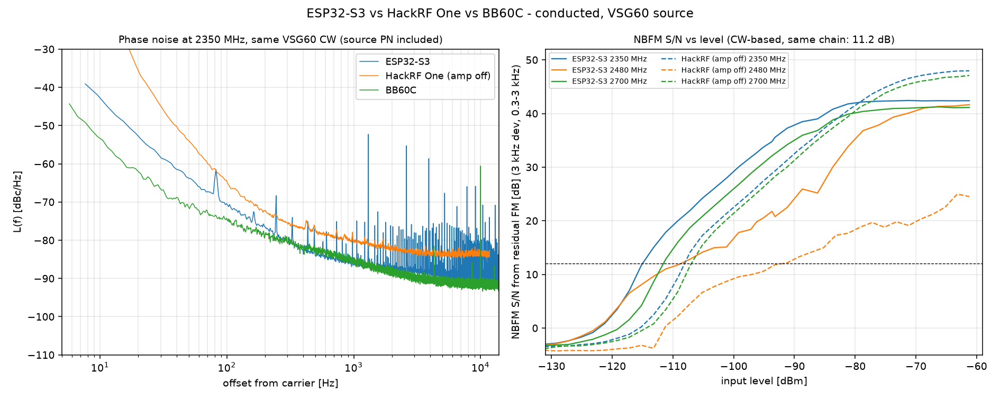

### 6-hour VSG campaign and receiver characterisation (3 Oct 2026)

Setup: ESP32-S3 with ESP-SDR, PCB antenna, Signal Hound VSG60 in the near field, so levels are relative; ratios, frequencies, stability and integrity counters are exact.

| | Result |
| --- | --- |
| Integrity | **0 CRC errors, 0 gaps, 0 lost samples** in 5.6 h of soak (4.7 M frames, 1.5 G IQ samples) |
| Stress | 300 random retunes, 100 IQ/spectrum mode switches, 50 stop/start cycles: 0 failures |
| Retune | 80 ms median, 112 ms max; first sample already within 50 Hz |
| IQ passband / image | 0.1 dB p-p within ±80 kHz (250 kS/s); image −57 … −70 dBc |
| Linearity / IM3 | 66 dB linear range; two-tone IM3 −54 dBc |
| Stability | ADEV 3.3e-9 @ 1 s; −0.07 … +0.04 ppm over 5.6 h after one PPM calibration |
| Spectrum mode | all 18 profiles at 50 spectra/s; DC spike from +8 … +24 dB down to +0.6 dB with the module's fix |

<table>
<tr>
<td>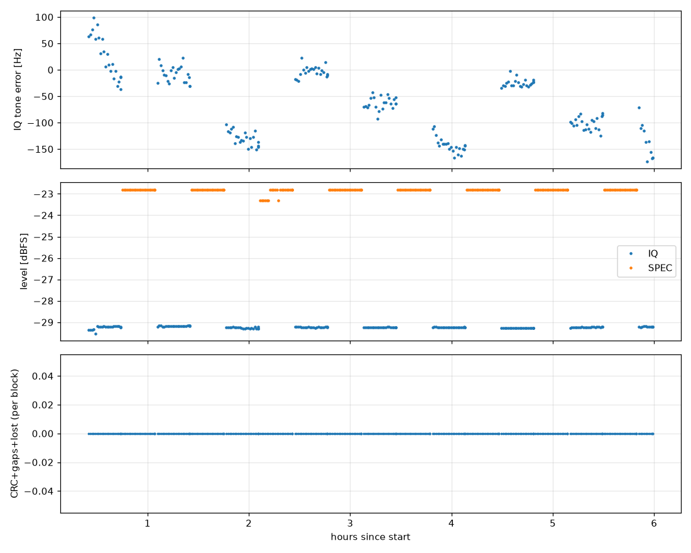<br><sub>5.6 h soak: frequency, level, errors (zero)</sub></td>
<td>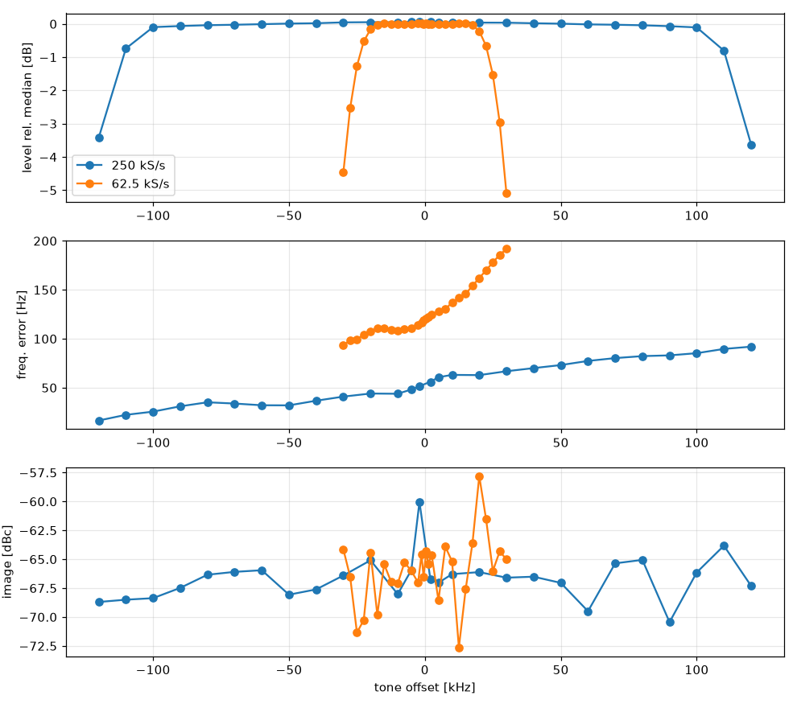<br><sub>IQ passband, frequency error and image across the band</sub></td>
</tr>
<tr>
<td>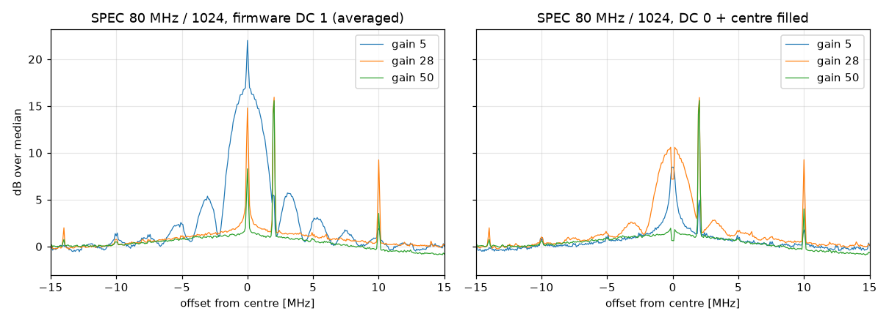<br><sub>Spectrum-mode centre: firmware default vs. module DC fix</sub></td>
<td>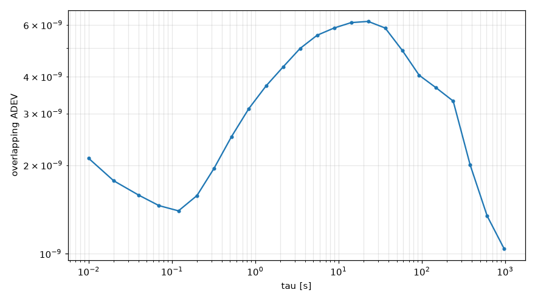<br><sub>Allan deviation, 1 h gapless capture</sub></td>
</tr>
</table>

### Conducted: phase noise, NBFM SINAD, sensitivity (5 Oct 2026)

Setup: Signal Hound VSG60 → cable + 10 dB pad (11.2 dB measured) → coax pigtail soldered to the S3 module (PCB antenna removed), 62.5 kS/s 16-bit IQ, gain 70; levels are at the S3 input.

| | 2350 MHz | 2480 MHz | 2700 MHz |
| --- | --- | --- | --- |
| Phase noise @ 100 Hz / 1 kHz / 10 kHz (dBc/Hz) | −70 / −86 / −90 | −68 / −82 / −83 ¹ | −70 / −85 / −89 |
| NBFM SINAD, strong signal (1 kHz tone, 3 kHz dev, 0.3–3 kHz) | 42 dB | 41 dB | 41 dB |
| NBFM 12 dB SINAD sensitivity | **−114 dBm** | **−112 dBm** | **−111.5 dBm** |

- **Stability:** bare 40 MHz crystal, no TCXO. ADEV 6e-10 @ 1 s and 4e-9 @ 100 s. 97 Hz p-p over 20 min at 2350 MHz in still air; a draught can move it by several hundred Hz.
- **Tuning error:** crystal offset (about −1.7 ppm on this board, VSG60 reference included) plus a deterministic ±150 Hz sawtooth with a 30 MHz period from the fractional-N PLL.
- **Linearity:** the 62.5 kS/s link is linear to −60 dBm at gain 70. The 8-bit 250 kS/s link saturates about 48 dB above the noise and has a phase-noise floor near −74 dBc/Hz, so use 62.5 kS/s for anything precise.

Caveats:
- Above about 300 Hz offset the phase noise is an upper bound. An S3 and a BB60C measured with the same VSG60 give nearly identical curves there, so the generator's own phase noise is likely included; at 100 Hz the S3 is about 5 dB worse than the BB60C.
- VSG60 output checked with a BB60C: linear within ±0.1 dB from −50 to −120 dBm; the cable + 10 dB pad chain loses 11.2 dB at 2350 MHz, which is used for the input levels below (the pigtail's own loss is not included, so the sensitivity figures are slightly conservative).
- ¹ 2480 MHz is 62 × 40 MHz, an internal birdie of the board, and it sits in the Wi-Fi band. Nearby Wi-Fi leaked into the unshielded board: switching the access points off cut the disturbed 0.25 s blocks from 6.4 to 3.7 per 4 s capture and moved the 2480 MHz sensitivity from −109 to −112 dBm.

<table>
<tr>
<td colspan="2">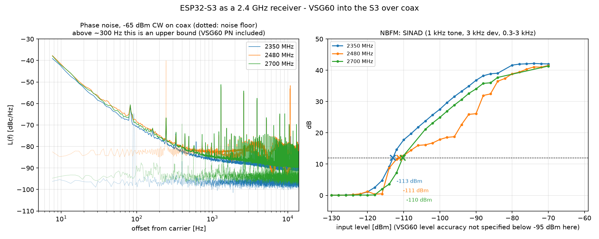<br><sub>Phase noise (left) and NBFM SINAD vs. input level (right), conducted</sub></td>
</tr>
<tr>
<td>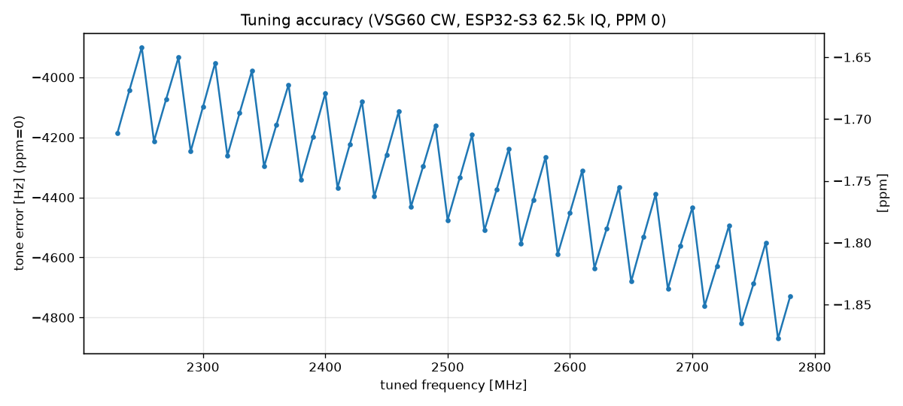<br><sub>Tuning error 2230–2780 MHz: crystal offset + PLL sawtooth</sub></td>
<td>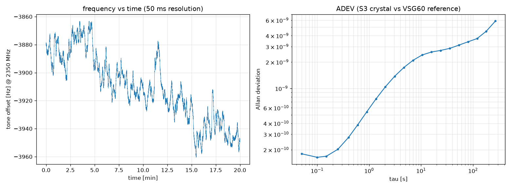<br><sub>20 min frequency track and Allan deviation</sub></td>
</tr>
</table>

Scripts: `tools/hwcampaign.py` (whole campaign, `--atten`, `--levels`), `tools/hwpn.py` (phase noise / residual FM / SINAD maths, `--selftest`), `tools/pn_ext.py` (the same tests on HackRF, RTL-SDR and BB60C), `tools/pn_compare.py`, `tools/hwfreqtrack.py`, `tools/hwimd.py` (noise figure vs gain, two-tone IMD3, blocking, IQ image / DC; `--dut hackrf`), `tools/imd_replot.py`.

Full report with all plots (tuning error map, gain curve, linearity, noise, phase noise, IMD3, blocking, latency, IQ imbalance vs. frequency): **[docs/MEASUREMENTS.md](docs/MEASUREMENTS.md)**

Tips from the measurements: in spectrum mode use gain 40 or more; set the PPM after a few minutes of streaming; for strong signals at 250 kS/s (8-bit link) lower the gain or use 125 / 62.5 kS/s.

## Use

1. Flash the ESP32-S3 with current [ESP-SDR](https://github.com/ESPARGOS/esp-sdr) firmware (IQS stream, ESP32-S3 target), e.g. `esp-sdr-s3-iq-stream.bin` from the [esp-sdr-bridge releases](https://github.com/z2labs/esp-sdr-bridge/releases/latest).
2. Copy `esp_sdr_source.dll` into the SDR++ `modules` folder.
3. Start SDR++, open *Module Manager*, add an instance of `esp_sdr_source` (or add `"ESP-SDR Source": {"enabled": true, "module": "esp_sdr_source"}` to `moduleInstances` in `config.json`).
4. Source: **ESP-SDR (ESP32-S3)**, pick the board's native USB port (COMx / `/dev/ttyACM0`), sample rate, press play.

If the board does not answer, it may still be in its bootloader after flashing: press RESET or replug it.

## Wideband 16 / 40 / 80 MHz spectrum (needs an SDR++ core API)

ESP-SDR's Turbo Mode streams **16–80 MHz wide spectra** computed on the chip (as in the ESP-WebSDR browser viewer). The module has a display-only *Spectrum 16 / 40 / 80 MHz* mode (256 / 1024 / 2048 bins, optional max hold) that feeds these spectra straight into the SDR++ waterfall. There is no IQ in this mode, so nothing can be demodulated.

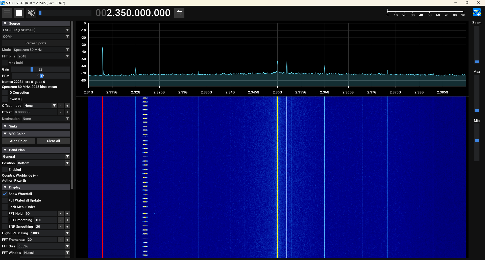

*Spectrum 80 MHz, 2048 bins, gain 28: 2.31–2.39 GHz in one view, CW test tone (−50 dBm, near-field) at 2.360 GHz, 0 CRC errors, 0 gaps.*

Stock SDR++ cannot take a precomputed spectrum from a source: the core always computes the waterfall from IQ. The same gap blocks an FFT-only SDR++ Server mode, [SDR++ #1356](https://github.com/AlexandreRouma/SDRPlusPlus/issues/1356). The wideband mode therefore needs the small `IQFrontEnd::setExternalFFTInput` API, implemented on branch `feat/server-fft-stream` and planned as an SDR++ pull request. CMake detects it (`-DESP_SDR_EXTERNAL_FFT=AUTO|ON|OFF`); against a stock SDR++ the module builds with the IQ mode only, so it loads in official releases and nightlies. Details: [docs/wideband-spectrum.md](docs/wideband-spectrum.md).

## Build

The module builds either inside the SDR++ tree or out-of-tree against an existing SDR++ build. The module uses SDR++'s C++ API, so build it against the same SDR++ version you run.

**In-tree** (the way it would go upstream): copy this folder to `SDRPlusPlus/source_modules/esp_sdr_source` and add to the SDR++ top-level `CMakeLists.txt`:

```cmake
option(OPT_BUILD_ESP_SDR_SOURCE "Build ESP-SDR (ESP32-S3) Source Module (no dependencies required)" ON)
if (OPT_BUILD_ESP_SDR_SOURCE)
add_subdirectory("source_modules/esp_sdr_source")
endif (OPT_BUILD_ESP_SDR_SOURCE)
```

**Out-of-tree** (Windows example, same toolchain as the SDR++ build):

```
cmake -S . -B build -G "Visual Studio 17 2022" -A x64 -DCMAKE_TOOLCHAIN_FILE=C:/vcpkg/scripts/buildsystems/vcpkg.cmake ^
      -DSDRPP_SOURCE_DIR=D:/src/SDRPlusPlus -DSDRPP_BUILD_DIR=D:/src/SDRPlusPlus/build
cmake --build build --config Release
```

No dependencies beyond SDR++ itself; the serial port code is plain Win32 / POSIX.

`esp_sdr_test` (built alongside) streams from the board without SDR++ and prints rate, CRC and gap counters:

```
esp_sdr_test COM4 2350e6 60 250000 10 capture.cf32
esp_sdr_test COM4 2350e6 40 80000000 10 - 0 256     # Turbo spectrum: peak and median per second
```

## How it works

The module tunes the S3 4 MHz (fs/4) below the wanted frequency and starts the `IQS` stream in mode 2: the chip shifts the samples by +fs/4 before its FIR filters, so the LO leakage and the 1/f noise at 0 Hz IF are filtered out instead of sitting in the middle of the spectrum. IQS1 frames (64-bit sample index, CRC32) are checked, scaled to full scale ±1.0, the residual DC is tracked and the spectrum is oriented like any other SDR. Protocol: `docs/iq-stream.md` in ESP-SDR.

## Credits

- [ESP-SDR](https://github.com/ESPARGOS/esp-sdr) by Florian Euchner / ESPARGOS.
- [SDR++](https://github.com/AlexandreRouma/SDRPlusPlus) by Alexandre Rouma (Ryzerth); module structure follows its source modules.
- Turbo Mode developed by Zoltan Doczi from https://www.z2labs.io

## License

GPL-3.0, like SDR++. Copyright (c) 2026 Zoltan Doczi.
