# Hardware measurements: ESP32-S3 + ESP-SDR, SDR++ source module

Measured 2026-10-03 on an ESP32-S3 dev board (PCB antenna) running ESP-SDR with the IQS stream and Turbo Mode (SPEC), against a Signal Hound VSG60 (CW / two-tone, at most -50 dBm) in the near field of the antenna. The host side is `tools/esp_sdr_emu`, which drives the same client code (`src/esp_sdr_client.cpp`) the SDR++ module uses, scripted by `tools/hwtest.py`, `tools/hwlong.py` and `tools/hwextra.py`; this report is generated by `tools/hwreport.py`.

**Levels are relative.** The coupling is radiated (no coax connector on the board), so dBm values are at the VSG output, not at the receiver input. Ratios (dBc, dB of dynamic range), frequencies, stability, latency and integrity counters are exact.

## Summary

| | Result |
| --- | --- |
| Integrity | 6 h campaign + 1.3 h characterisation: **0 CRC errors, 0 frame gaps, 0 lost samples**; 4.7 M frames, 1.5 G IQ samples in the 5.6 h soak alone |
| Stress | 300 random retunes (incl. drag bursts), 100 IQ/SPEC mode switches, 50 stop/start cycles, 8 x 49 mini rounds: **0 failures** |
| Retune / mode switch | 80 ms median, 112 ms max until the stream runs; first sample after a retune already within 50 Hz (no visible PLL settling) |
| Start (port open to stream) | 0.64 s |
| IQ passband | 250 kS/s: 0.10 dB p-p within +-80 kHz, -3.4 dB at +-120 kHz; 62.5 kS/s: 0.23 dB p-p within +-20 kHz |
| IQ image (fs/4 IF) | -57 ... -70 dBc over 2230-2780 MHz |
| SPEC mirror (LO at centre) | -24 ... -37 dBc (IQ imbalance, not hidden by fs/4 in this mode) |
| SPEC bin accuracy / rate | peak within 0.4 bins everywhere; all 18 profiles (16/40/80 MHz x 256/1024/2048 x mean/max hold) 50 spectra/s, 0 errors |
| SPEC centre (DC) | firmware default (`DC 1`): centre bin +8 ... +24 dB; module fix (`DC 0` + centre filled): **+0.6 dB at gain 50** |
| Linearity | IQ 62.5k (1 Hz bins): 66 dB within 1 dB (-50 ... -116 dBm at the VSG); below that the VSG's own minimum level / leakage |
| Two-tone IM3 (-53 dBm per tone) | -54 dBc (250k) / -55 dBc (62.5k) at gain 62; -10 dBc at gain 82 on the 8-bit 250k link (clipping), -24 dBc on 62.5k |
| Blocking | CW blocker at +-0.2 ... +-20 MHz (incl. the LO at -4 MHz and the IF image at -8 MHz): in-band floor rise at most 1.5 dB |
| Noise density | gain 60: -116 dBFS/Hz at all three IQ rates; gain 82: -95 dBFS/Hz |
| Close-in noise of a CW | -74 dBc/Hz @ 100 Hz, -83 dBc/Hz @ 1-10 kHz (VSG60 included) |
| Frequency stability | ADEV 3.3e-9 @ 1 s, 5.9e-9 @ 10 s, 4.0e-9 @ 100 s (vs VSG60 TCXO); 5.6 h after one PPM calibration: -0.07 ... +0.04 ppm |
| Frequency offset | board reads 0.9 ... 1.7 ppm high depending on load and time: re-check PPM after a few minutes of streaming |
| Tuning resolution | 1 kHz on the chip; residual removed by a host NCO (module): error after calibration 1-20 Hz, plus a deterministic PLL pattern of 0 / -150 / -300 Hz (see P) |
| Latency (VSG on to data at host) | 200-240 ms in all modes, dominated by the VSG60's own output switching (upper bound) |

## What changed in the module because of these measurements

- **Host NCO for sub-kHz tuning.** The S3 LO is set in 1 kHz steps (FREQ MHz + FOFS kHz); the module now removes the rounding residual digitally, so the PPM correction works continuously.
- **SPEC DC fix.** `DC 0` (per-FFT DC removal on the chip) and the centre bin filled from its neighbours; the firmware default `DC 1` is restored when leaving SPEC (for the web viewer).
- **Recommendations.** SPEC: gain 40 or higher (at low gain a +-2 MHz near-DC noise hump of the zero-IF receiver is visible). Strong signals on the 250 kS/s 8-bit link: lower the gain or use 125 / 62.5 kS/s (16-bit), the 8-bit scaling keeps the noise only a few LSB above zero.

## Open points

- **PLL frequency pattern.** After drift removal the tuning error takes ~150 Hz steps (0 / -150 / -300 Hz, repeating every 15 MHz) and also varies inside 1 MHz; a plain fractional-N quantisation model does not fit. Needs the PHY's PLL formula to compensate exactly.
- **SPEC IQ imbalance.** -24 ... -37 dBc mirror; a gain/phase correction before the on-chip FFT (firmware) with a per-frequency table from `Q` would fix it.
- **8-bit link headroom** at 250 kS/s: an option for one more bit of headroom.
- **EVM** with a QAM signal: needs the modulation set up by hand in Spike (not scriptable over SCPI).

## 6-hour campaign (`long6h`)

Run long6h, port COM4, f0 2350 MHz. VSG CW -50 dBm, near-field coupling.
Gain index 60, PPM calibration 0.929 ppm (residual +15.6 Hz).
Total CRC errors 0, gaps 0, lost samples 0.

### A. IQ CW sweep across the band (LO fixed)

- 250 kS/s: level -29.3 dBFS, flatness within +-80 kHz: 0.10 dB p-p, edge (+-120 kHz) -3.4 dB; image -60.0 dBc worst; integrated SNR (incl. phase noise) 26.7 dB median
- 62.5 kS/s: level -29.3 dBFS, flatness within +-20 kHz: 0.23 dB p-p, edge (+-30 kHz) -4.5 dB; image -57.8 dBc worst; integrated SNR (incl. phase noise) 32.2 dB median

### B. S3 LO sweep 2210-2800 MHz, VSG following at +40 kHz

- level -40.5 ... -28.8 dBFS over the range (VSG -50 dBm, near-field coupling, not a calibrated gain)
- frequency error after one PPM calibration at 2350 MHz: -183 ... +291 Hz (std 133 Hz)
- VSG off, 2 MHz steps: 295 of 296 tunings show a line > 15 dB above the bin floor: 2210 MHz (+2.5 kHz, 23 dB), 2212 MHz (+69.7 kHz, 21 dB), 2214 MHz (+26.4 kHz, 23 dB), 2216 MHz (+2.6 kHz, 29 dB), 2218 MHz (+2.7 kHz, 33 dB), 2220 MHz (+2.7 kHz, 25 dB), 2222 MHz (-63.2 kHz, 21 dB), 2224 MHz (+2.8 kHz, 34 dB), 2226 MHz (-42.6 kHz, 22 dB), 2228 MHz (+95.5 kHz, 22 dB), 2230 MHz (-43.4 kHz, 21 dB), 2232 MHz (+2.9 kHz, 25 dB)

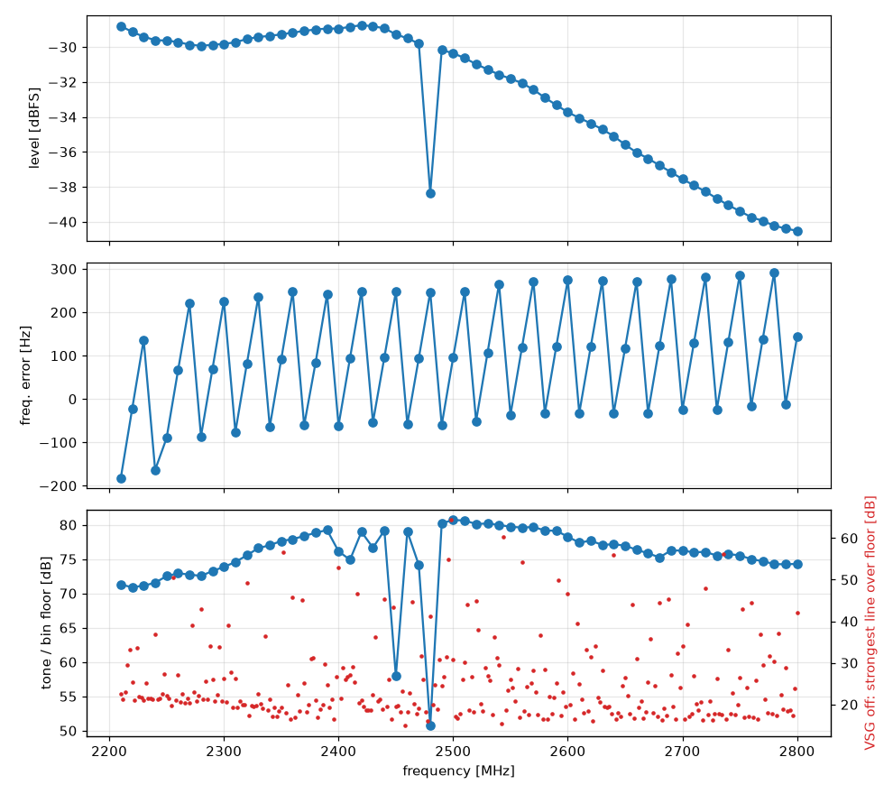

### C. On-chip spectrum (SPEC): bin accuracy, flatness, mirror

- 16 MHz / 256: bin error max 0.40 bins; level p-p over +-40% span 1.5 dB; mirror worst -22.5 dB; median -56.1 dBFS
- 40 MHz / 1024: bin error max 0.40 bins; level p-p over +-40% span 2.5 dB; mirror worst -22.0 dB; median -56.3 dBFS
- 80 MHz / 1024: bin error max 0.40 bins; level p-p over +-40% span 4.0 dB; mirror worst -21.0 dB; median -56.2 dBFS
- 80 MHz / 2048: bin error max 0.40 bins; level p-p over +-40% span 4.0 dB; mirror worst -22.7 dB; median -59.3 dBFS

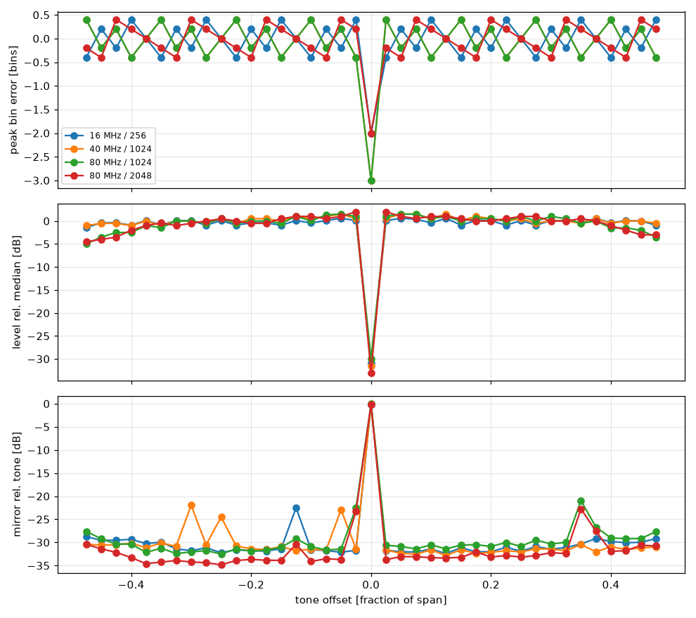

#### Centre (DC / LO leakage) in SPEC 80 MHz, VSG off

| DC handling | gain | bins | centre over median [dB] | hump > +6 dB width [MHz] | median [dBFS] |
| --- | --- | --- | --- | --- | --- |
| firmware DC 1 (averaged) | 5 | 256 | +14.0 | 0.62 | -70.5 |
| firmware DC 1 (averaged) | 5 | 1024 | +22.0 | 3.44 | -77.0 |
| firmware DC 1 (averaged) | 5 | 2048 | +23.9 | 2.15 | -80.5 |
| firmware DC 1 (averaged) | 28 | 256 | +8.7 | 2.19 | -62.1 |
| firmware DC 1 (averaged) | 28 | 1024 | +14.8 | 10.08 | -68.6 |
| firmware DC 1 (averaged) | 28 | 2048 | +18.3 | 10.86 | -72.0 |
| firmware DC 1 (averaged) | 50 | 256 | +3.9 | 0.31 | -59.0 |
| firmware DC 1 (averaged) | 50 | 1024 | +8.3 | 2.03 | -65.4 |
| firmware DC 1 (averaged) | 50 | 2048 | +11.0 | 2.07 | -68.6 |
| DC 0 + centre filled | 5 | 256 | +11.5 | 3.12 | -70.8 |
| DC 0 + centre filled | 5 | 1024 | +8.5 | 0.31 | -77.5 |
| DC 0 + centre filled | 5 | 2048 | +11.0 | 2.15 | -80.5 |
| DC 0 + centre filled | 28 | 256 | +5.6 | 2.81 | -62.1 |
| DC 0 + centre filled | 28 | 1024 | +7.2 | 11.25 | -68.6 |
| DC 0 + centre filled | 28 | 2048 | +6.1 | 10.08 | -71.9 |
| DC 0 + centre filled | 50 | 256 | -0.6 | 0.31 | -59.1 |
| DC 0 + centre filled | 50 | 1024 | +0.6 | 0.08 | -65.4 |
| DC 0 + centre filled | 50 | 2048 | +1.8 | 0.08 | -68.6 |

### D. Stress (SDR++ host calls via esp_sdr_emu)

- random retunes (all rates, every 10th a 20-step drag burst): 300, failed 0, CRC 0, gaps 0, lost 0
- IQ <-> SPEC mode switches: 100, failed 0, CRC 0, gaps 0, lost 0
- stop / start cycles: 50, failed 0, CRC 0, gaps 0, lost 0
- retune latency (update -> stream running): median 79 ms, 95% 102 ms, max 112 ms
- mode switch latency: median 82 ms, max 101 ms
- start (port open + CAPS + stream) latency: median 636 ms, max 643 ms
- soak SPEC 80 MHz / 256 120 s: frames 6006, CRC 0, gaps 0, lost 0, 0.0 spectra/s, signal checks 2 failed 0
- soak IQ 250 kS/s 120 s: frames 58718, CRC 0, gaps 0, lost 0, 250013.7 samples/s, signal checks 2 failed 0

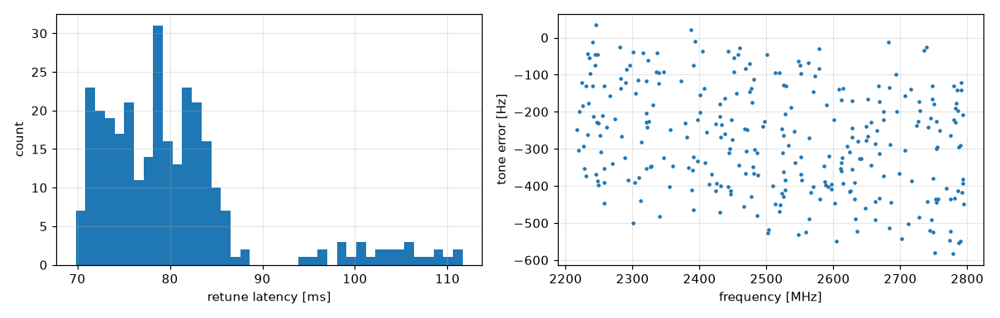

### P. Tuning error map (crystal drift removed with a reference at 2350 MHz)

- error after drift removal: -390 ... +59 Hz, std 129 Hz over 200 points
- within 2430-2431 MHz (50 kHz steps): -353 ... +59 Hz

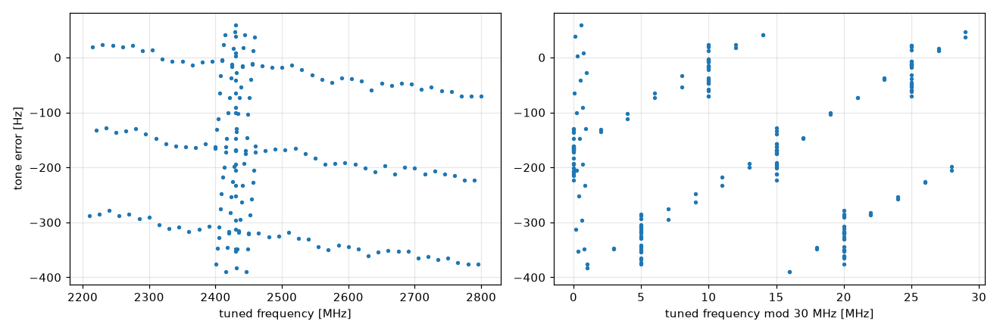

### G. Gain curve (62.5 kS/s, 16-bit link, CW -50 dBm)

- gain range 0-82: tone -81.0 ... -10.1 dBFS (70.9 dB span), mean slope 0.74 dB per index step (20-60)
- best tone/floor 81.5 dB at gain 78

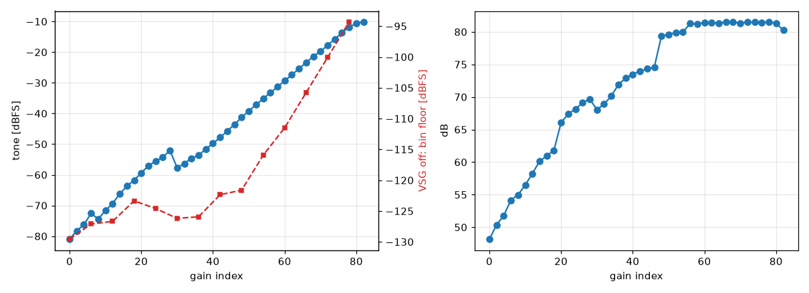

### L. Level linearity down to the noise (VSG -50 ... -130 dBm, near-field: relative input)

- IQ 62.5k (1 Hz bins), gain 60: within 1 dB of a straight line from -50 to -116 dBm at the VSG = 66 dB linear range; at -50 dBm +0.1 dB (compression); below that the reading stays at -97.2 dBFS
- IQ 62.5k (1 Hz bins), gain 82: within 1 dB of a straight line from -54 to -118 dBm at the VSG = 64 dB linear range; at -50 dBm -1.9 dB (compression); below that the reading stays at -76.0 dBFS
- SPEC 80 MHz / 1024 (78 kHz bins), gain 40: within 1 dB of a straight line from -50 to -66 dBm at the VSG = 16 dB linear range; at -50 dBm +0.0 dB (compression); below that the reading stays at -65.2 dBFS
- SPEC 80 MHz / 1024 (78 kHz bins), gain 60: within 1 dB of a straight line from -50 to -74 dBm at the VSG = 24 dB linear range; at -50 dBm +0.0 dB (compression); below that the reading stays at -52.9 dBFS

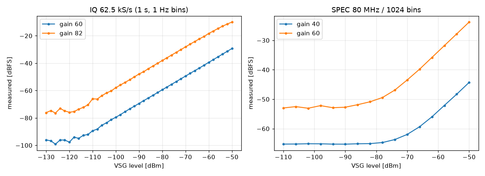

### N. Noise floor

| gain | rate | noise density [dBFS/Hz] |
| --- | --- | --- |
| 60 | 250 kS/s | -115.9 |
| 60 | 125 kS/s | -115.8 |
| 60 | 62.5 kS/s | -116.5 |
| 82 | 250 kS/s | -95.0 |
| 82 | 125 kS/s | -95.0 |
| 82 | 62.5 kS/s | -95.3 |

- SPEC 80 MHz / 1024 median vs gain: 0: -80.4, 6: -77.0, 12: -77.0, 18: -72.2, 24: -72.2, 30: -76.4, 36: -74.3, 42: -68.9, 48: -67.5, 54: -61.3, 60: -56.3, 66: -50.3, 72: -44.9, 78: -38.8 dBFS

### R. SPEC profiles: spectra per second to the host

| span | bins | detector | spectra/s | CRC | gaps |
| --- | --- | --- | --- | --- | --- |
| 16 MHz | 256 | mean | 50.0 | 0 | 0 |
| 16 MHz | 256 | max hold | 50.0 | 0 | 0 |
| 16 MHz | 1024 | mean | 50.0 | 0 | 0 |
| 16 MHz | 1024 | max hold | 50.0 | 0 | 0 |
| 16 MHz | 2048 | mean | 50.0 | 0 | 0 |
| 16 MHz | 2048 | max hold | 50.0 | 0 | 0 |
| 40 MHz | 256 | mean | 50.0 | 0 | 0 |
| 40 MHz | 256 | max hold | 50.0 | 0 | 0 |
| 40 MHz | 1024 | mean | 50.0 | 0 | 0 |
| 40 MHz | 1024 | max hold | 50.0 | 0 | 0 |
| 40 MHz | 2048 | mean | 50.0 | 0 | 0 |
| 40 MHz | 2048 | max hold | 50.0 | 0 | 0 |
| 80 MHz | 256 | mean | 50.0 | 0 | 0 |
| 80 MHz | 256 | max hold | 50.0 | 0 | 0 |
| 80 MHz | 1024 | mean | 49.8 | 0 | 0 |
| 80 MHz | 1024 | max hold | 50.0 | 0 | 0 |
| 80 MHz | 2048 | mean | 50.2 | 0 | 0 |
| 80 MHz | 2048 | max hold | 49.8 | 0 | 0 |

### S. After a retune: tone frequency and level in 2 ms slices

- 30 retunes (hops 0.1 ... 200 MHz): the first sample delivered is already within 50 Hz after 2 ms at the latest; first data 99 ... 107 ms after the update

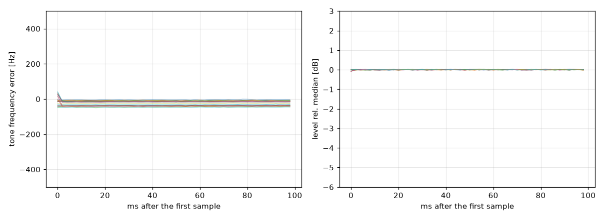

### F. Close-in noise of a received CW (VSG60 phase noise included)

- 62.5 kS/s: 100 Hz: -74 dBc/Hz, 300 Hz: -81 dBc/Hz, 1000 Hz: -83 dBc/Hz, 3000 Hz: -84 dBc/Hz, 10000 Hz: -84 dBc/Hz
- 250 kS/s: 100 Hz: -71 dBc/Hz, 300 Hz: -80 dBc/Hz, 1000 Hz: -83 dBc/Hz, 3000 Hz: -83 dBc/Hz, 10000 Hz: -83 dBc/Hz, 30000 Hz: -84 dBc/Hz, 100000 Hz: -85 dBc/Hz

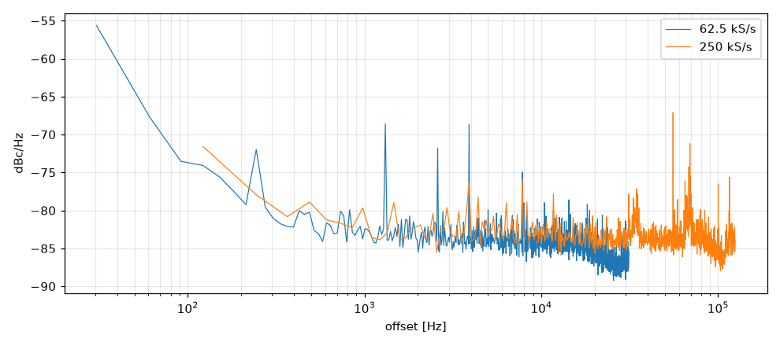

### W. Long soak (20 min IQ / SPEC blocks, check every minute)

- 5.6 h, 363 checks, 17 blocks, 4711064 frames, 1.53e+09 IQ samples: CRC 0, gaps 0, lost 0; client never stopped
- frequency (PPM calibrated once at the start): -173 ... +99 Hz at 2350 MHz (-0.07 ... +0.04 ppm)
- 8 mini rounds (LO sweep, 30 retunes, mode switches, 5 stop/start): 392 checks, 0 failed

## Receiver characterisation (`hwextra`)

Run hwextra, port COM4, f0 2350 MHz. VSG CW -50 dBm, near-field coupling.
Gain index 60, PPM calibration 1.066 ppm (residual -1.8 Hz).
Total CRC errors 0, gaps 0, lost samples 0.

### T. Allan deviation (gapless 3600 s capture, S3 crystal vs VSG60 reference)

- ADEV(0.1 s) = 1.4e-09, ADEV(1 s) = 3.3e-09, ADEV(10 s) = 5.9e-09, ADEV(100 s) = 4.0e-09
- drift 5.6 Hz/h at 2350 MHz (0.002 ppm/h); CRC 0, gaps 0, lost 0 during the capture
- short tau is set by the CW's SNR, long tau by temperature; the VSG60's own TCXO is in the result as well

### K. Out-of-band CW blocker (-50 dBm at the VSG): in-band noise-floor rise and leakage

- 250 kS/s: floor rise 1.3 dB worst (blocker at +0.2 MHz); -8.0 MHz: +0.0 dB, -4.0 MHz: +0.2 dB, +4.0 MHz: +0.1 dB, +8.0 MHz: -0.0 dB
  - blocker at -8 MHz (image of the fs/4 IF): strongest in-band line -67.3 dBFS at +0.2 kHz
- 62.5 kS/s: floor rise 1.5 dB worst (blocker at -0.2 MHz); -8.0 MHz: +0.1 dB, -4.0 MHz: -0.0 dB, +4.0 MHz: -0.0 dB, +8.0 MHz: +0.0 dB
  - blocker at -8 MHz (image of the fs/4 IF): strongest in-band line -67.2 dBFS at +0.0 kHz

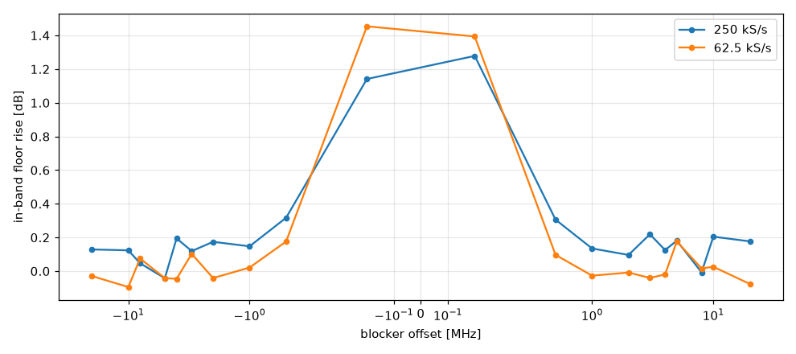

### M. Latency: VSG output on -> first affected data at the host

| mode | n | median [ms] | min [ms] | max [ms] |
| --- | --- | --- | --- | --- |
| IQ 250 kS/s | 15 | 203.1 | 198.1 | 229.5 |
| IQ 62.5 kS/s | 15 | 213.0 | 199.1 | 232.4 |
| SPEC 80 MHz / 1024 | 15 | 228.4 | 207.0 | 239.4 |
| SPEC 80 MHz / 256 | 15 | 226.5 | 202.3 | 243.3 |

Includes the VSG60's own switching time (upper bound for the receive path); clock offset emulator vs script 1.01 ms.

### Q. IQ imbalance across the tuning range

- SPEC (LO at the centre, no fs/4): mirror -36.8 ... -13.9 dBc over 2230-2780 MHz and +5 ... +30 MHz offsets
- IQ mode (fs/4 IF): in-band image -70.5 ... -56.6 dBc

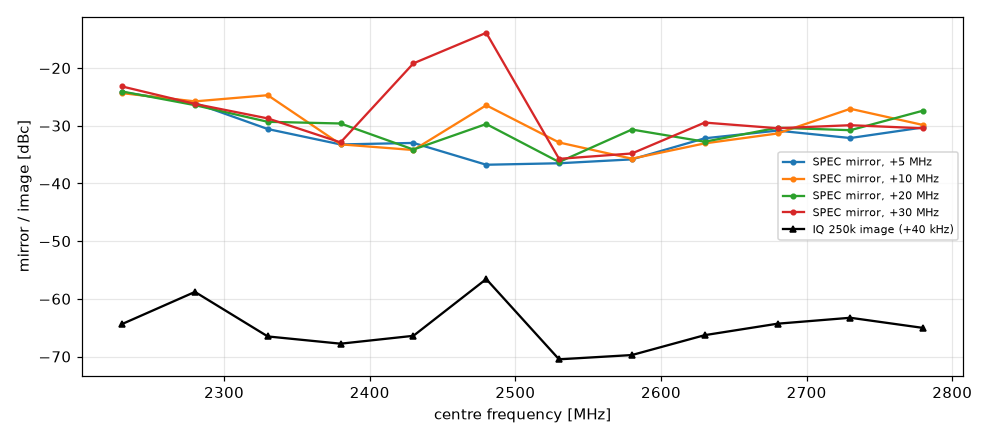

## Two-tone IMD3 (`hwextra_I`)

Run hwextra_I, port COM4, f0 2350 MHz. VSG CW -50 dBm, near-field coupling.
Gain index auto, PPM calibration 1.570 ppm (residual +6.6 Hz).
Total CRC errors 0, gaps 0, lost samples 0.

### I. Two-tone IMD3 (VSG60 multitone, 2 tones)

- 250 kS/s, VSG -50 dBm: IM3 -53.9 dBc at gain 62 (best), -9.9 dBc at gain 82 (max)
- 250 kS/s, gain 60: IM3 below the floor over most of the level sweep
- 62.5 kS/s, VSG -50 dBm: IM3 -55.3 dBc at gain 62 (best), -24.4 dBc at gain 82 (max)
- 62.5 kS/s, gain 60: IM3 below the floor over most of the level sweep

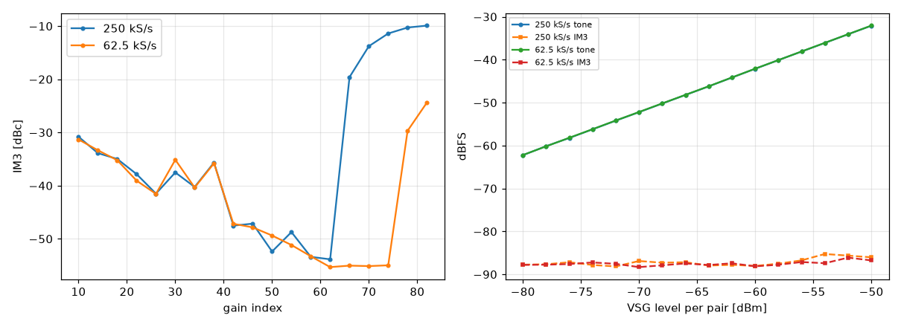

## Conducted campaign: phase noise, NBFM, sensitivity (`campaign_coax10`, 5 Oct 2026)

Setup: Signal Hound VSG60 → 10 dB pad → coax pigtail soldered to the S3 module, PCB antenna removed, board not shielded. IQ 62.5 kS/s (16-bit link) unless noted, PPM 0. All levels are at the S3 input (VSG level − 10 dB). Script: `tools/hwcampaign.py --atten 10`; maths in `tools/hwpn.py` (`--selftest` checks L(f), residual FM and SINAD on synthetic signals with known values).

### A. Linearity per gain (2350 MHz)

The 62.5 kS/s link is linear up to −60 dBm at gain 70. The 8-bit 250 kS/s link has its full scale tied to the gain and hits a ceiling about 48 dB above the noise; at −65 dBm only gain ≤ 30 stays linear there.

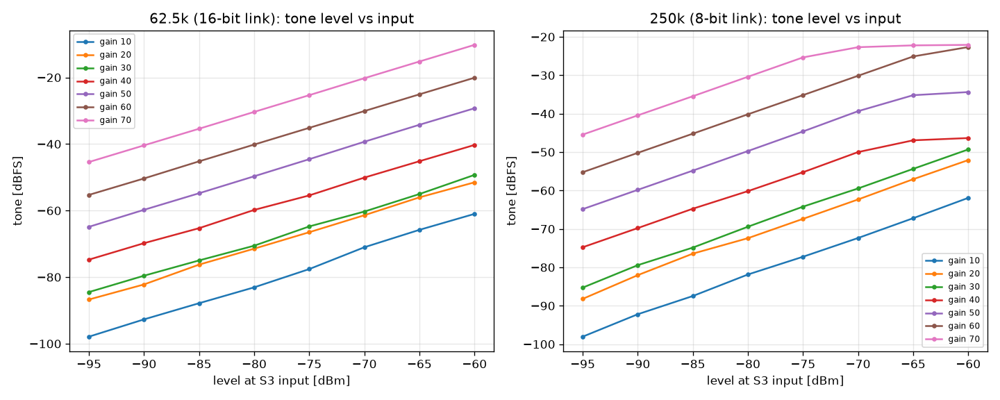

### G. Tuning error 2230–2780 MHz (10 MHz steps)

The error is a straight crystal-offset line (about −1.76 ppm on this board; the VSG60 reference error is included) plus a deterministic sawtooth from the fractional-N PLL: +150 Hz every 10 MHz, −300 Hz every 30 MHz. The sawtooth is repeatable and can be corrected in the host.

### C. Phase noise (−65 dBm CW)

Each measurement averages 3 s blocks, removing each block's own tone frequency and slow drift, so the crystal's thermal wander does not leak into the close-in offsets. Floor = same chain with the VSG off.

| Offset | 100 Hz | 1 kHz | 10 kHz | floor |
| --- | --- | --- | --- | --- |
| 2350 MHz | −70 | −86 | −90 | −97 dBc/Hz |
| 2480 MHz | −68 | −82 | −83 | −82 dBc/Hz (62 × 40 MHz birdie) |
| 2700 MHz | −70 | −85 | −89 | −94 dBc/Hz |

- A repeat at 2350 MHz after the 20 min run gave −71 / −86 / −90.
- Above ~300 Hz offset these are upper bounds. A BB60C measured with the same VSG60 gives nearly the same curve (−85 dBc/Hz @ 1 kHz, −91 @ 10 kHz), so the generator's phase noise is probably what both see. At 100 Hz the S3 is about 5 dB worse than the BB60C, which is the S3's own close-in noise.
- Internal spurs at 80 Hz, 240 Hz, 1.3 kHz and 2.6 kHz offset show at every frequency; 240 Hz is also present with the VSG off.
- The 250 kS/s (8-bit) link's floor is about −74 dBc/Hz, so it cannot measure phase noise; values above 13 kHz offset are therefore not reported.

### B. Frequency stability (20 min gapless capture, 2350 MHz)

Mean offset −3911 Hz (−1.66 ppm), 97 Hz p-p over 20 min, 0 gaps. ADEV about 2e-10 at 0.1 s, 5.9e-10 at 1 s and 3.6e-9 at 100 s; this is the S3 crystal against the VSG60's internal reference. The crystal is bare (no TCXO): blowing on the board shifted the carrier by several hundred Hz.

### D / E. NBFM: residual FM and SINAD vs. level

- **D:** the residual FM of a CW in the 0.3–3 kHz audio band gives the phase-noise-limited S/N for 3 kHz deviation.
- **E:** VSG60 FM (1 kHz sine, 3 kHz deviation) demodulated by an ideal discriminator (±7.5 kHz brick-wall IF), SINAD in 0.25 s blocks with a ±12 Hz notch, median over the blocks.
- At 2350 MHz the two methods agree within 1 dB at the 12 dB point (−113.1 vs −113.9 dBm).

| Input | 2350 MHz | 2480 MHz | 2700 MHz |
| --- | --- | --- | --- |
| −70 dBm | 42 dB | 41.5 dB | 41.4 dB |
| −90 dBm | 36.8 dB | 26.1 dB | 34.0 dB |
| −100 dBm | 27.5 dB | 17.9 dB | 24.9 dB |
| **12 dB SINAD** | **−113 dBm** | **−111 dBm** | **−110 dBm** |

Notes:
- The board is unshielded and the antenna feed is open, so nearby 2.4 GHz traffic leaks in and shows as 0.25 s blocks where the carrier amplitude dips and the discriminator clicks. Those blocks are excluded and counted.
  - With the Wi-Fi access points on: 6.4 disturbed blocks per 4 s capture, 2 of 45 captures clean, 2480 MHz sensitivity −108 dBm.
  - With them off: 3.7 per capture, 23 of 39 clean, 2480 MHz sensitivity −111 dBm.
  - Some disturbance remained (2700 MHz, −72…−82 and −106…−108 dBm have no valid point). A shielded box is needed for a final number.
- Below −95 dBm at the S3 input (VSG below −85 dBm) the VSG60's level accuracy is not specified, so the sensitivity figures are ±2–3 dB until checked against a calibrated receiver.
- The strong-signal ceiling of about 42 dB is set by close-in phase noise / residual FM; part of it may be the VSG60's.
